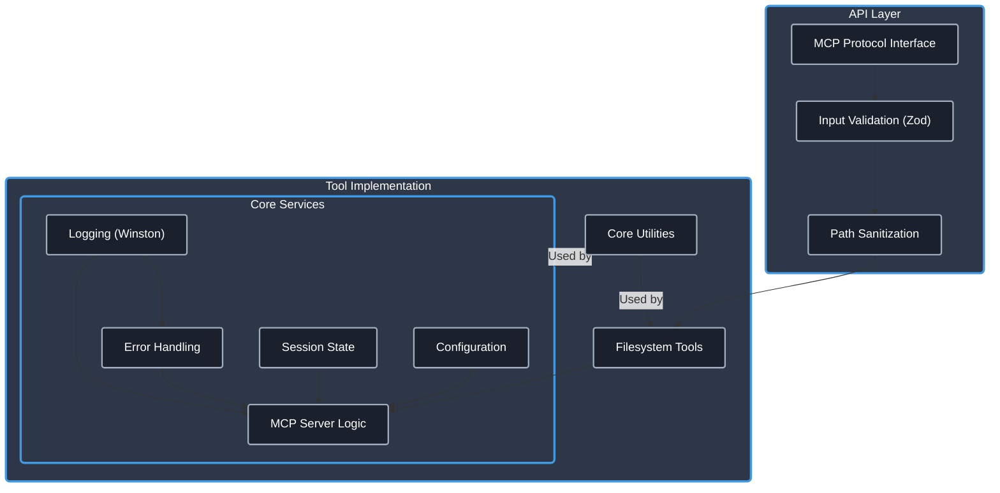

# Filesystem MCP Server

[](https://www.typescriptlang.org/)
[](https://modelcontextprotocol.io/)
[]()
[](https://opensource.org/licenses/Apache-2.0)
[]()
[](https://github.com/cyanheads/filesystem-mcp-server)

**Empower your AI agents with robust, platform-agnostic file system capabilities.**

This [Model Context Protocol (MCP)](https://modelcontextprotocol.io/) server provides a secure and reliable interface for AI agents to interact with the local filesystem. It enables reading, writing, updating, and managing files and directories, backed by a production-ready TypeScript foundation featuring comprehensive logging, error handling, and security measures.

## Table of Contents

- [Overview](#overview)
- [Features](#features)
- [Installation](#installation)
- [Configuration](#configuration)
- [Usage with MCP Clients](#usage-with-mcp-clients)
- [Available Tools](#available-tools)
- [Project Structure](#project-structure)
- [Development](#development)
- [License](#license)

## Overview

The Model Context Protocol (MCP) is a standard framework allowing AI models to securely interact with external tools and data sources (resources). This server implements the MCP standard to expose essential filesystem operations as tools, enabling AI agents to:

- Read and analyze file contents.
- Create, modify, or overwrite files.
- Manage directories and file paths.
- Perform targeted updates within files.

Built with TypeScript, the server emphasizes type safety, modularity, and robust error handling, making it suitable for reliable integration into AI workflows.

### Architecture

The server employs a layered architecture for clarity and maintainability:



- **API Layer**: Handles MCP communication, validates inputs using Zod, and sanitizes paths.
- **Core Services**: Manages configuration, logging, error reporting, session state (like the default working directory), and the main MCP server instance.
- **Tool Implementation**: Contains the specific logic for each filesystem tool, leveraging shared utilities.

## Features

- **Comprehensive File Operations**: Tools for reading, writing, listing, deleting, moving, and copying files and directories.
- **Targeted Updates**: `update_file` tool allows precise search-and-replace operations within files, supporting plain text and regex.
- **Session-Aware Path Management**: `set_filesystem_default` tool establishes a default working directory for resolving relative paths during a session.
- **Security First**: Built-in path sanitization prevents directory traversal attacks. Optional base directory restriction enhances security.
- **Robust Foundation**: Includes production-grade utilities for:
  - Structured, context-aware logging.
  - Standardized error handling with specific error codes.
  - Unique ID generation for request tracing.
  - Input sanitization.
  - Optional rate limiting (util file created but not yet integrated).
- **Type Safety**: Fully implemented in TypeScript for improved reliability and maintainability.

## Installation

### Steps

1.  **Clone the repository:**
    ```bash
    git clone https://github.com/cyanheads/filesystem-mcp-server.git
    cd filesystem-mcp-server
    ```
2.  **Install dependencies:**
    ```bash
    npm install
    ```
3.  **Build the project:**
    ```bash
    npm run build
    ```
    This compiles the TypeScript code to JavaScript in the `dist/` directory and makes the main script executable. The executable will be located at `dist/index.js`.

## Configuration

Configure the server using environment variables:

- **`FS_BASE_DIRECTORY`** (Optional, **Recommended for Security**):
  - If set to an absolute path, all file operations performed by the server will be strictly confined within this directory and its subdirectories. This prevents the AI agent from accessing files outside the intended scope.
  - Example: `FS_BASE_DIRECTORY=/Users/casey/safe-agent-files`
- **`LOG_LEVEL`** (Optional):
  - Controls the verbosity of logs. Options: `error`, `warn`, `info`, `http`, `verbose`, `debug`, `silly`.
  - Defaults to `info`.
- **`LOG_DIR`** (Optional):
  - Specifies the directory where log files (`combined.log`, `error.log`) will be stored.
  - Defaults to `./logs` relative to the server's execution directory.

## Usage with MCP Clients

To allow an MCP client (like an AI assistant) to use this server:

1.  **Run the Server:** Start the server from your terminal:
    ```bash
    node dist/index.js
    # Or if you are in the project root:
    # npm start
    ```
2.  **Configure the Client:** Add the server to your MCP client's configuration. The exact method depends on the client, but typically involves specifying:

    - **Command:** `node`
    - **Arguments:** The absolute path to the built server executable (e.g., `/path/to/filesystem-mcp-server/dist/index.js`).
    - **Environment Variables (Optional):** Set `FS_BASE_DIRECTORY`, `LOG_LEVEL`, or `LOG_DIR` as needed.

    **Example MCP Settings (Conceptual):**

    ```json
    {
      "mcpServers": {
        "filesystem": {
          "command": "node",
          "args": ["/path/to/filesystem-mcp-server/dist/index.js"],
          "env": {
            "FS_BASE_DIRECTORY": "/path/to/base/directory",
            "LOG_LEVEL": "debug"
          },
          "disabled": false,
          "autoApprove": []
        }
        // ... other servers
      }
    }
    ```

Once configured and running, the client will detect the server and its available tools.

## Available Tools

The server exposes the following tools for filesystem interaction:

| Tool                         | Description                                                                                                                                                                                                                                                                                                        |
| :--------------------------- | :----------------------------------------------------------------------------------------------------------------------------------------------------------------------------------------------------------------------------------------------------------------------------------------------------------------- |
| **`set_filesystem_default`** | Sets a default absolute path for the current session. Relative paths used in subsequent tool calls will be resolved against this default. Resets on server restart.                                                                                                                                                |
| **`read_file`**              | Reads the entire content of a specified file as UTF-8 text. Accepts relative (resolved against default) or absolute paths.                                                                                                                                                                                         |
| **`write_file`**             | Writes content to a specified file. Creates the file (and necessary parent directories) if it doesn't exist, or overwrites it if it does. Accepts relative or absolute paths.                                                                                                                                      |
| **`update_file`**            | Performs targeted search-and-replace operations within an existing file using an array of `{search, replace}` blocks. Ideal for localized changes. Supports plain text or regex search (`useRegex: true`) and replacing all occurrences (`replaceAll: true`). Accepts relative or absolute paths. File must exist. |
| **`list_files`**             | Lists files and directories within a specified path. Options include recursive listing (`includeNested: true`) and limiting the number of entries (`maxEntries`). Returns a formatted tree structure. Accepts relative or absolute paths.                                                                          |
| **`delete_file`**            | Permanently removes a specific file. Accepts relative or absolute paths.                                                                                                                                                                                                                                           |
| **`delete_directory`**       | Permanently removes a directory. Use `recursive: true` to remove non-empty directories and their contents (use with caution!). Accepts relative or absolute paths.                                                                                                                                                 |
| **`create_directory`**       | Creates a new directory at the specified path. By default (`create_parents: true`), it also creates any necessary parent directories. Accepts relative or absolute paths.                                                                                                                                          |
| **`move_path`**              | Moves or renames a file or directory from a source path to a destination path. Accepts relative or absolute paths for both.                                                                                                                                                                                        |
| **`copy_path`**              | Copies a file or directory from a source path to a destination path. For directories, it copies recursively by default (`recursive: true`). Accepts relative or absolute paths.                                                                                                                                    |

_Refer to the tool registration files (`src/mcp-server/tools/*/registration.ts`) for detailed input/output schemas (Zod/JSON Schema)._

## Project Structure

The codebase is organized for clarity and maintainability:

```
filesystem-mcp-server/
├── dist/                 # Compiled JavaScript output (after npm run build)
├── logs/                 # Log files (created at runtime)
├── node_modules/         # Project dependencies
├── src/                  # TypeScript source code
│   ├── config/           # Configuration loading (index.ts)
│   ├── mcp-server/       # Core MCP server logic
│   │   ├── server.ts     # Server initialization and tool registration
│   │   ├── state.ts      # Session state management (e.g., default path)
│   │   └── tools/        # Individual tool implementations (one subdir per tool)
│   │       ├── readFile/
│   │       │   ├── index.ts
│   │       │   ├── readFileLogic.ts
│   │       │   └── registration.ts
│   │       └── ...       # Other tools (writeFile, updateFile, etc.)
│   ├── types-global/     # Shared TypeScript types and interfaces
│   │   ├── errors.ts     # Custom error classes and codes
│   │   ├── mcp.ts        # MCP related types
│   │   └── tool.ts       # Tool definition types
│   ├── utils/            # Reusable utility modules
│   │   ├── errorHandler.ts
│   │   ├── idGenerator.ts
│   │   ├── index.ts
│   │   ├── logger.ts
│   │   ├── rateLimiter.ts
│   │   ├── requestContext.ts
│   │   └── sanitization.ts
│   └── index.ts          # Main application entry point
├── .clinerules           # Cheatsheet for LLM assistants
├── .gitignore
├── LICENSE
├── package.json
├── package-lock.json
├── README.md             # This file
└── tsconfig.json         # TypeScript compiler options
```

For a live, detailed view of the current structure, run: `npm run tree`

> **Developer Note:** This repository includes a [.clinerules](.clinerules) file. This cheat sheet provides your LLM coding assistant with essential context about codebase patterns, file locations, and usage examples. Keep it updated as the server evolves!

## License

This project is licensed under the Apache License 2.0. See the [LICENSE](LICENSE) file for details.

---

<div align="center">
Built with ❤️ and the <a href="https://modelcontextprotocol.io/">Model Context Protocol</a>
</div>
