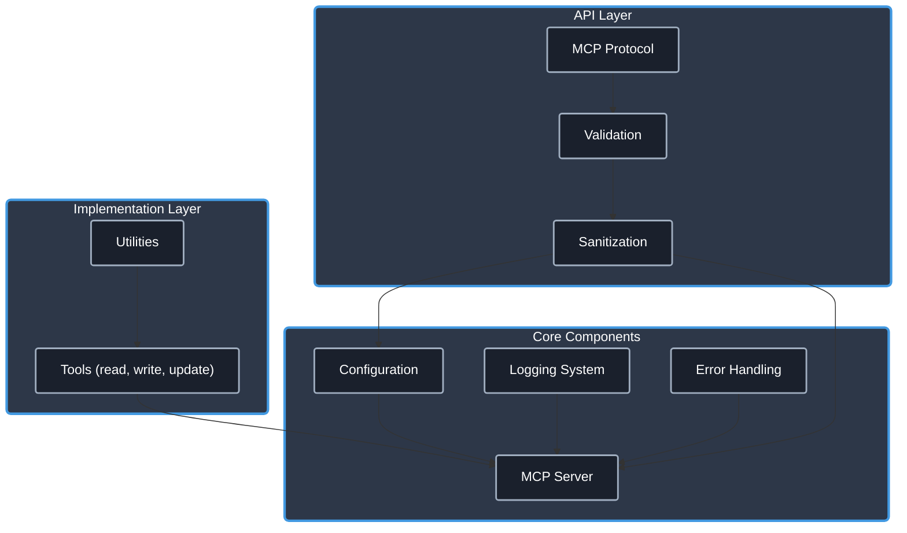

# Filesystem MCP Server

[](https://www.typescriptlang.org/)
[](https://modelcontextprotocol.io/)
[]()
[](https://opensource.org/licenses/Apache-2.0)
[]()
[](https://github.com/cyanheads/filesystem-mcp-server) <!-- Assuming this will be the repo URL -->

A [Model Context Protocol (MCP)](https://modelcontextprotocol.io/) server providing platform-agnostic file system capabilities for AI agents. This server allows MCP clients to read, write, and perform advanced search-and-replace operations on files within a configured environment.

Built upon a robust TypeScript foundation, this server includes production-ready utilities for logging, error handling, and security.

## Features

- **Core File Operations**: Provides tools for reading, writing, and updating file contents.
- **Advanced Updates**: Includes an `update_file` tool for targeted search-and-replace using a diff-like format.
- **Security**: Incorporates path sanitization and validation to prevent unauthorized file access.
- **Robust Utilities**: Leverages a set of reusable utilities for logging, error handling, ID generation, rate limiting, and request context management.
- **Type Safety**: Strong typing with TypeScript to catch errors at compile time.
- **Error Handling**: A robust error handling system that categorizes and formats errors consistently.

> **.clinerules**: This repository includes a [.clinerules](.clinerules) file that serves as a developer cheat sheet for your LLM coding agent with quick reference for the codebase patterns, file locations, and code snippets. Remember to keep it updated as you modify the server.

## Table of Contents

- [Overview](#overview)
  - [What is Model Context Protocol?](#what-is-model-context-protocol)
  - [Architecture & Components](#architecture--components)
- [Features](#features)
- [Installation](#installation)
- [Configuration](#configuration)
- [Project Structure](#project-structure)
- [Tool Documentation](#tool-documentation)
- [Development Guidelines](#development-guidelines)
  - [Adding a New Tool](#adding-a-new-tool)
  - [Adding a New Resource](#adding-a-new-resource)
- [License](#license)

## Overview

### What is Model Context Protocol?

Model Context Protocol (MCP) is a framework that enables AI systems to interact with external tools and resources. It allows language models to:

- Execute **tools** that perform actions and return results
- Access structured **resources** that provide information
- Create contextual workflows through standardized interfaces

This server provides essential file system tools for AI agents operating within an MCP environment.

### Architecture & Components

The server follows a modular architecture designed for clarity and extensibility:

<details>
<summary>Click to expand architecture diagram</summary>



</details>

Core Components:

- **Configuration System**: Environment-aware configuration with validation.
- **Logging System**: Structured logging with sensitive data redaction.
- **Error Handling**: Centralized error processing with consistent patterns.
- **MCP Server**: Protocol implementation for tools.
- **Validation & Sanitization Layer**: Input validation and path sanitization using `validator` and custom logic.
- **Utilities**: Reusable utility functions for common operations.

## Installation

### Prerequisites

- [Node.js (v18+)](https://nodejs.org/)
- [npm](https://www.npmjs.com/) or [yarn](https://yarnpkg.com/)

### Setup

1. Clone this repository:

   ```bash
   # Replace with the actual repository URL when available
   git clone https://github.com/cyanheads/filesystem-mcp-server.git
   cd filesystem-mcp-server
   ```

2. Install dependencies:

   ```bash
   npm install
   ```

3. Build the project:

   ```bash
   npm run build
   ```

## Configuration

### MCP Client Settings & Environment Variables

Add to your MCP client settings (e.g., in VS Code settings or a dedicated configuration file):

```json
{
  "mcpServers": {
    "filesystem": { // Choose a suitable name
      "command": "node",
      "args": ["/path/to/filesystem-mcp-server/dist/index.js"],
      "env": {
        // Optional: Define a base directory to restrict file operations
        // "FS_BASE_DIRECTORY": "/path/to/allowed/directory"
      }
    }
  }
}
```

### Environment Variables

- `FS_BASE_DIRECTORY` (Optional): If set, restricts all file operations to paths within this directory. Highly recommended for security.
- `LOG_LEVEL` (Optional): Sets the logging level (e.g., `debug`, `info`, `warn`, `error`). Defaults to `info`.
- `LOG_DIR` (Optional): Specifies the directory for log files. Defaults to `./logs`.

## Project Structure

The codebase follows a modular structure within the `src/` directory, including configurations (`config/`), MCP server logic (`mcp-server/` with tools), global types (`types-global/`), and common utilities (`utils/`).

For a detailed, up-to-date view of the project structure, run:

```bash
npm run tree
```

## Tool Documentation

| Tool           | Description                                                                                                                               | Input Schema                                                                                                                                                           | Output Schema                               |
| -------------- | ----------------------------------------------------------------------------------------------------------------------------------------- | ---------------------------------------------------------------------------------------------------------------------------------------------------------------------- | ------------------------------------------- |
| **read_file**  | Reads the entire content of a specified file.                                                                                             | `{ "type": "object", "properties": { "path": { "type": "string", "description": "Path to the file" } }, "required": ["path"] }`                                       | `{ "content": "string" }`                   |
| **write_file** | Writes content to a specified file. Creates the file (and directories) if it doesn't exist, overwrites it if it does.                       | `{ "type": "object", "properties": { "path": { "type": "string", "description": "Path to the file" }, "content": { "type": "string", "description": "Content to write" } }, "required": ["path", "content"] }` | Success/Failure confirmation (via status) |
| **update_file**| Performs targeted search-and-replace operations within an existing file using `<<<<<<< SEARCH ... ======= ... >>>>>>> REPLACE` blocks. | `{ "type": "object", "properties": { "path": { "type": "string", "description": "Path to the file" }, "diff": { "type": "string", "description": "Search/Replace blocks" } }, "required": ["path", "diff"] }` | Success/Failure confirmation (via status) |

*Note: Input/Output schemas are simplified here. Refer to the tool registration files for the exact JSON Schema definitions.*

## Development Guidelines

### Adding a New Tool

1.  **Create Directory**: `src/mcp-server/tools/myNewTool/`
2.  **Define Logic & Schema**: `myNewToolLogic.ts` (Input/Output types, validation schema, core function).
3.  **Implement Registration**: `registration.ts` (Import logic, schema, `McpServer`, `ErrorHandler`. Use `server.tool()` wrapped in `ErrorHandler.tryCatch`).
4.  **Export Registration**: `index.ts` (Export registration function).
5.  **Register in Server**: `src/mcp-server/server.ts` (Import and call registration function).

### Adding a New Resource

(While this server focuses on tools, the process remains similar if resources are needed later.)

1.  **Create Directory**: `src/mcp-server/resources/myNewResource/`
2.  **Define Logic & Schema**: `myNewResourceLogic.ts` (Params type, query schema, core function).
3.  **Implement Registration**: `registration.ts` (Import logic, schema, `McpServer`, `ResourceTemplate`, `ErrorHandler`. Define `ResourceTemplate`. Use `server.resource()` wrapped in `ErrorHandler.tryCatch`).
4.  **Export Registration**: `index.ts` (Export registration function).
5.  **Register in Server**: `src/mcp-server/server.ts` (Import and call registration function).

## License

This project is licensed under the Apache License 2.0 - see the [LICENSE](LICENSE) file for details.

---

<div align="center">
Built with the <a href="https://modelcontextprotocol.io/">Model Context Protocol</a>
</div>
