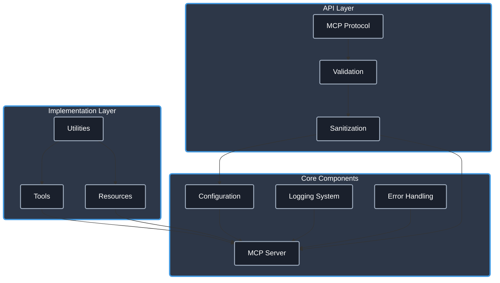

# MCP TypeScript Template

[](https://www.typescriptlang.org/)
[](https://modelcontextprotocol.io/)
[]()
[](https://opensource.org/licenses/Apache-2.0)
[](https://github.com/cyanheads/mcp-ts-template/issues)
[](https://github.com/cyanheads/mcp-ts-template)

A beginner-friendly foundation for building [Model Context Protocol (MCP)](https://modelcontextprotocol.io/) servers (and in the future also clients) with TypeScript. This template provides a comprehensive starting point with production-ready utilities, well-structured code, and working examples for building an MCP server.

Copy this repo to kickstart your own MCP server and set your **vibe code** session up for success!

## Using this template as your repo will get you:

- **Utilities**: A set of reusable utilities for logging, error handling, ID generation, rate limiting, and request context management.
- **Type Safety**: Strong typing with TypeScript to catch errors at compile time.
- **Security**: Built-in security features to protect against common vulnerabilities.
- **Error Handling**: A robust error handling system that categorizes and formats errors consistently.
- **Documentation**: Comprehensive documentation for tools and resources, including usage examples and implementation details.
- **Example Implementations**: Working examples of [echo_message (tool)](src/mcp-server/tools/echoTool/) and [echo://hello (resource)](src/mcp-server/resources/echoResource/) to help you get started quickly.

> **.clinerules**: This repository includes a [.clinerules](.clinerules) file that serves as a developer cheat sheet for your LLM coding agent with quick reference for the codebase patterns, file locations, and code snippets. When copying this template for your own project, be sure to update the cheat sheet to reflect your modifications and additions.

## Table of Contents

- [Overview](#overview)
  - [What is Model Context Protocol?](#what-is-model-context-protocol)
  - [Architecture & Components](#architecture--components)
- [Features](#features)
  - [Core Utilities](#core-utilities)
  - [Type Safety](#type-safety)
  - [Error Handling](#error-handling)
  - [Security](#security)
  - [Example Implementations](#example-implementations)
- [Installation](#installation)
- [Configuration](#configuration)
- [Project Structure](#project-structure)
- [Tool & Resource Documentation](#tool--resource-documentation)
  - [Tools](#tools)
  - [Resources](#resources)
- [Development Guidelines](#development-guidelines)
  - [Adding a New Tool](#adding-a-new-tool)
  - [Adding a New Resource](#adding-a-new-resource)
- [Future Plans](#future-plans)
- [License](#license)

## Overview

### What is Model Context Protocol?

Model Context Protocol (MCP) is a framework that enables AI systems to interact with external tools and resources. It allows language models to:

- Execute **tools** that perform actions and return results
- Access structured **resources** that provide information
- Create contextual workflows through standardized interfaces

This template gives you a head start in building MCP servers that can be used by AI systems to extend their capabilities.

### Architecture & Components

The template follows a modular architecture designed for clarity and extensibility:

<details>
<summary>Click to expand architecture diagram</summary>



</details>

Core Components:

- **Configuration System**: Environment-aware configuration with validation
- **Logging System**: Structured logging with sensitive data redaction
- **Error Handling**: Centralized error processing with consistent patterns
- **MCP Server**: Protocol implementation for tools and resources
- **Validation Layer**: Input validation and sanitization using `validator` and `sanitize-html`.
- **Utilities**: Reusable utility functions for common operations

## Features

### Core Utilities

- **Logging**: Configurable logging with file rotation and sensitive data redaction
- **Error Handling**: Pattern-based error classification and standardized reporting
- **ID Generation**: Secure unique identifier creation with prefix support
- **Rate Limiting**: Request throttling to prevent API abuse
- **Request Context**: Request tracking and correlation
- **Sanitization**: Input validation and cleaning using `validator` and `sanitize-html`.

### Type Safety

- **Global Types**: Shared type definitions for consistent interfaces
- **Error Types**: Standardized error codes and structures
- **MCP Protocol Types**: Type definitions for the MCP protocol
- **Tool Types**: Interfaces for tool registration and configuration

### Error Handling

- **Pattern-Based Classification**: Automatically categorize errors based on message patterns
- **Consistent Formatting**: Standardized error responses with additional context
- **Error Mapping**: Custom error transformation for domain-specific errors
- **Safe Try/Catch Patterns**: Centralized error processing helpers

### Security

- **Input Validation**: Using `validator` for various data type checks.
- **Input Sanitization**: Using `sanitize-html` to prevent injection attacks.
- **Parameter Bounds**: Enforced limits within sanitization logic to prevent abuse.
- **Sensitive Data Redaction**: Automatic redaction in logs.

### Example Implementations

- **[Echo Tool](src/mcp-server/tools/echoTool/)**: Complete example of a tool implementation including registration.
- **[Echo Resource](src/mcp-server/resources/echoResource/)**: Complete example of a resource implementation including registration.

## Installation

### Prerequisites

- [Node.js (v18+)](https://nodejs.org/)
- [npm](https://www.npmjs.com/) or [yarn](https://yarnpkg.com/)

### Setup

1. Clone this repository:

   ```bash
   git clone https://github.com/cyanheads/mcp-ts-template.git
   cd mcp-ts-template
   ```

2. Install dependencies:

   ```bash
   npm install
   ```

3. Build the project:

   ```bash
   npm run build
   ```

## Configuration

### MCP Client Settings & Environment Variables (Optional)

Add to your MCP client settings:

```json
{
  "mcpServers": {
    "atlas": {
      "command": "node",
      "args": ["/path/to/mcp-ts-template/dist/index.js"],
      "env": {}
    }
  }
}
```

### Configuration System

The configuration system provides a flexible way to manage settings:

- **Environment Config**: Load settings from environment variables
- **MCP Servers Config**: Configure MCP server connections (for future client implementations)
- **Lazy Loading**: Configurations are loaded only when needed

## Project Structure

The codebase follows a modular structure within the `src/` directory, including configurations (`config/`), MCP server logic (`mcp-server/` with tools and resources), global types (`types-global/`), and common utilities (`utils/`).

For a detailed, up-to-date view of the project structure, run the following command:

```bash
npm run tree
```

This command executes the `scripts/tree.ts` script, which generates a tree representation of the current project layout.

## Tool & Resource Documentation

### Tools

| Tool          | Description                                                                                                                      |
| ------------- | -------------------------------------------------------------------------------------------------------------------------------- |
| **Echo Tool** | Formats and echoes messages with various options. Demonstrates input validation, error handling, and proper response formatting. |

See the [Echo Tool implementation](src/mcp-server/tools/echoTool/) for detailed usage examples and implementation details.

### Resources

| Resource          | Description                                                                                                                            |
| ----------------- | -------------------------------------------------------------------------------------------------------------------------------------- |
| **Echo Resource** | Returns echo messages based on input parameters. Demonstrates resource registration, URI handling, and consistent response formatting. |

See the [Echo Resource implementation](src/mcp-server/resources/echoResource/) for detailed usage examples and implementation details.

## Development Guidelines

### Adding a New Tool

1.  **Create Directory**: Create a new directory for your tool under `src/mcp-server/tools/` (e.g., `src/mcp-server/tools/myNewTool/`).
2.  **Define Logic & Schema**: In a `myNewToolLogic.ts` file:
    - Define TypeScript interfaces for the tool's input and output.
    - Define the input validation schema (e.g., using Zod, although this template currently uses `validator` and manual checks).
    - Implement the core logic function that takes validated input and returns the output.
3.  **Implement Registration**: In a `registration.ts` file:
    - Import necessary types, the schema shape, the logic function, `McpServer`, `ErrorHandler`, and `logger`.
    - Create an `async` function (e.g., `registerMyNewTool`) that accepts the `McpServer` instance.
    - Inside this function, use `ErrorHandler.tryCatch` to wrap the `server.tool()` call.
    - Call `server.tool()` with:
      - The tool name (string).
      - The input schema's shape (e.g., `MyToolInputSchema.shape`).
      - An `async` handler function that:
        - Takes the validated `params`.
        - Uses `ErrorHandler.tryCatch` to wrap the call to your core logic function.
        - Formats the result according to the MCP specification (e.g., `{ content: [{ type: "text", text: JSON.stringify(result) }] }`).
        - Includes appropriate logging.
4.  **Export Registration**: In an `index.ts` file within your tool's directory, export the registration function (e.g., `export { registerMyNewTool } from './registration.js';`).
5.  **Register in Server**: In `src/mcp-server/server.ts`, import your registration function and call it, passing the `server` instance (e.g., `await registerMyNewTool(server);`).

```typescript
// In src/mcp-server/server.ts:
// import { registerMyNewTool } from './tools/myNewTool/index.js';
// ...
// await registerMyNewTool(server);
```

### Adding a New Resource

1.  **Create Directory**: Create a new directory for your resource under `src/mcp-server/resources/` (e.g., `src/mcp-server/resources/myNewResource/`).
2.  **Define Logic & Schema**: In a `myNewResourceLogic.ts` file:
    - Define TypeScript interfaces for any parameters (path or query).
    - Define the query validation schema if needed (e.g., using Zod, although this template currently uses `validator` and manual checks).
    - Implement the core logic function that takes the `uri` (URL object) and validated `params` and returns the resource data.
3.  **Implement Registration**: In a `registration.ts` file:
    - Import necessary types, schemas, the logic function, `McpServer`, `ResourceTemplate`, `ErrorHandler`, and `logger`.
    - Create an `async` function (e.g., `registerMyNewResource`) that accepts the `McpServer` instance.
    - Inside this function, use `ErrorHandler.tryCatch` to wrap the registration process.
    - Define a `ResourceTemplate` with the URI pattern and any `list` or `complete` operations.
    - Call `server.resource()` with:
      - A unique resource registration name (string).
      - The `ResourceTemplate` instance.
      - Resource metadata (name, description, mimeType, querySchema, examples).
      - An `async` handler function that:
        - Takes the `uri` (URL) and validated `params`.
        - Uses `ErrorHandler.tryCatch` to wrap the call to your core logic function.
        - Formats the result according to the MCP specification (e.g., `{ contents: [{ uri: uri.href, text: JSON.stringify(result), mimeType: "application/json" }] }`).
        - Includes appropriate logging.
4.  **Export Registration**: In an `index.ts` file within your resource's directory, export the registration function (e.g., `export { registerMyNewResource } from './registration.js';`).
5.  **Register in Server**: In `src/mcp-server/server.ts`, import your registration function and call it, passing the `server` instance (e.g., `await registerMyNewResource(server);`).

Example `registration.ts` structure

```typescript
// In src/mcp-server/server.ts:
// import { registerMyNewResource } from './resources/myNewResource/index.js';
// ...
// await registerMyNewResource(server);
```

## Future Plans

- **MCP Client Implementation**: Support for creating MCP clients that connect to various AI models

## License

This project is licensed under the Apache License 2.0 - see the [LICENSE](LICENSE) file for details.

---

<div align="center">
Built with the <a href="https://modelcontextprotocol.io/">Model Context Protocol</a>
</div>
